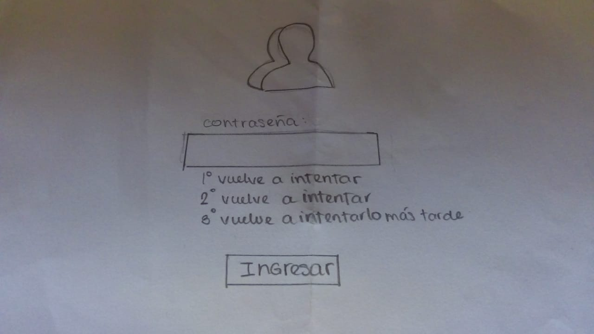
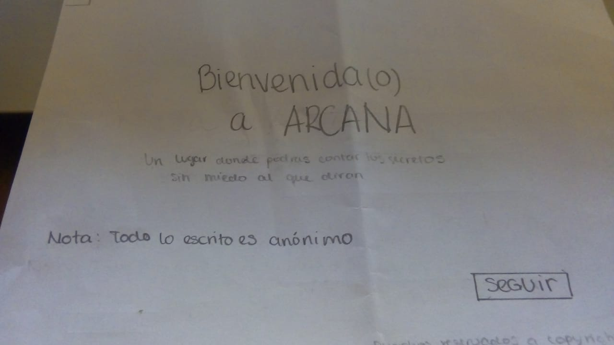
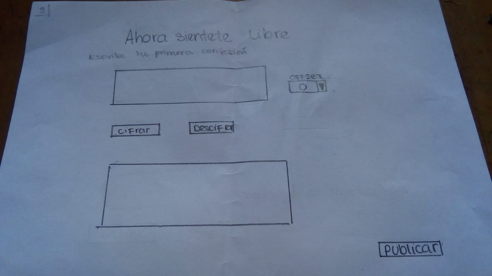
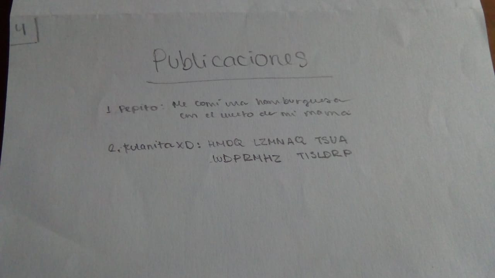
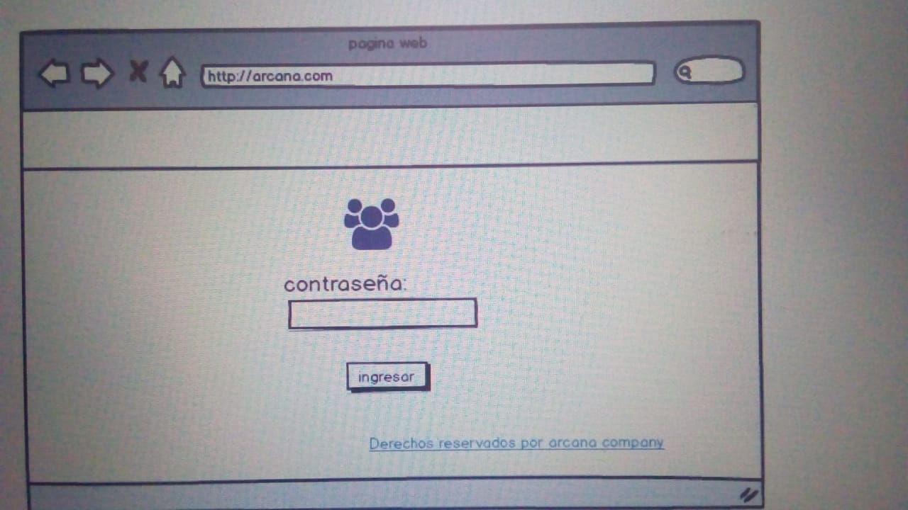
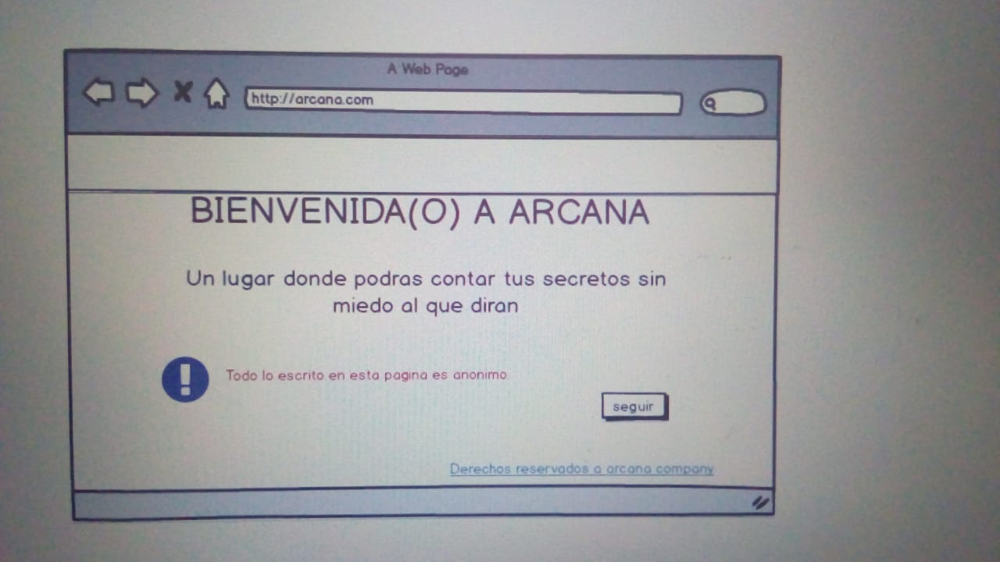
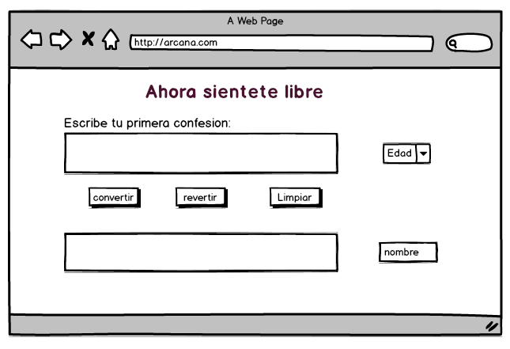
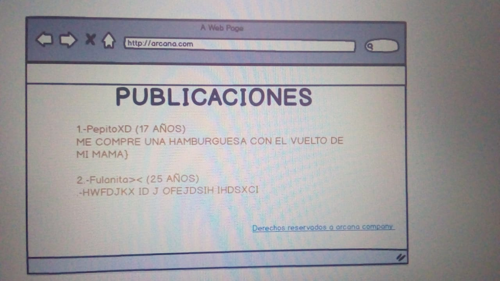
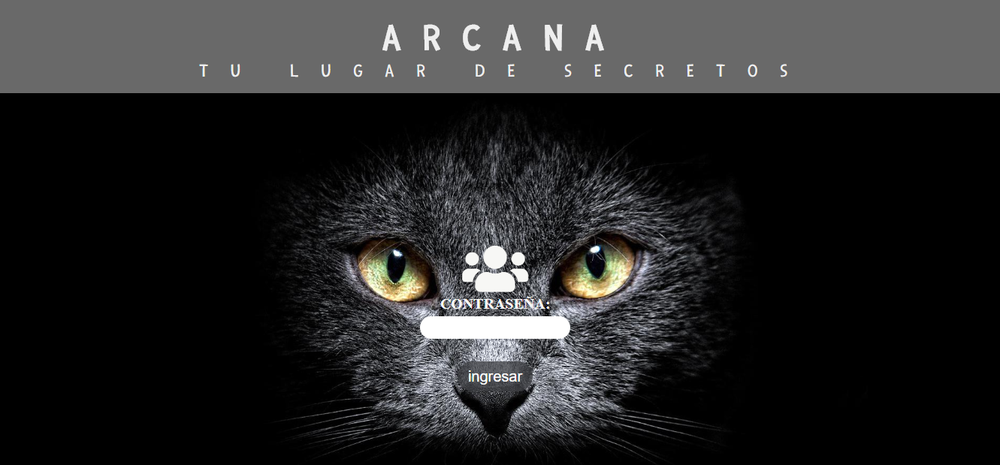

# ARCANA

## Preámbulo

Arcana es una pagina web donde podras compartir tus secretos con otras personas sin que sepan que eres tú.

## Investigación UX
Mis usuarios son personas que andan en sus 20 ,que como todas las personas guardan secretos ,ellos desean revelarlos para sentirse con menos carga ,pero saben que decirlos por si mismos es muy dificil ya que no solo les afectaria a ellos si no tambien a su entorno.

Por eso aparece **ARCANA** con la solucion en sus manos propone una web donde todo lo que digas es anonimo suponiendo asi una descarga para los usuarios porque encontraran la forma de decir sus secretos sin que les afecte a su entorno e imagen  y no tan solo eso ellos podran sentirse identificados con otras personas 

### Prototipo en papel

### Feedback
- Agregar un boton de limpiar en la pantalla 3
- Agregar un enncabezado y footer para todos
- Cambiar el nombre al boton de offset por otro mas entendible
- cambiar el nombre de los botones cifrar y descifrar porque no se entiende
- En la pantalla 4 agregar un boton de salir y volver.
- Poner indicaciones para hacerlo mas entendible.
- preguntar por el usuario en la primera pantalla.

### Prototipo en balsamiq

### Pantalla final

